数据集变化分析
==============

本页分析 ``prediction_model/dataset/initial_population.pkl`` 到
``prediction_model/dataset/final_population.pkl`` 的变化。数据由隔壁
``MASDiff`` 目录中的 SUMO/MASDiff 算法生成；本仓库只做离线分析、图表输出和文档展示。

分析脚本为 ``prediction_model/analyze_population_change.py``。脚本会输出 individual 级 CSV、
高维降维结果、位置热力图、选择压力诊断和 ``analysis_report.json``。

分析口径
--------

这批 population 不能简单理解成“第 i 个 initial individual 变成了第 i 个 final individual”。
根据 ``MASDiff/src/pipeline/runner.py`` 和 ``MASDiff/src/pipeline/steps.py``，迭代阶段会：

1. 用当前 population 训练扩散模型。
2. 按 ``rho`` 选择 elite。
3. 对 elite 的 reward 做截断扩散变异。
4. 重新训练 DQN、重新 SUMO 仿真、重新计算 ``rho``。
5. 将旧 population 和 mutants 合并，只保留 ``rho`` 最大的 top-M。

因此 ``final_population`` 是选择后的幸存种群，不是严格的逐行后代。文档中的
``final - initial`` 主要表示分布变化；真正的因果分析应优先依赖 ``parent_rho``、
``delta_parent_rho`` 等 lineage 信息。

核心结论
--------

- 共分析 initial/final 各 ``200`` 个 individual。
- ``rho`` 均值从 ``0.024489`` 上升到 ``0.025914``，平均提升 ``0.001424``。
- 若按 ``rho = 1 / (1 + MSE)`` 反推，估计 MSE 均值从 ``40.34`` 下降到 ``37.80``，
  平均下降 ``2.54``。
- ``reward_mean`` 只上升 ``0.000319``，``tau0_mean`` 只上升 ``0.0662``，
  ``tau1_mean`` 下降 ``0.0068``；这些变化远小于 ``rho`` 和估计 MSE 的变化。
- 完整 ``tau/reward/valid`` 高维张量经过特征哈希降维后再 PCA，前两维解释率只有
  ``4.31%`` 和 ``3.13%``，initial/final 大量重叠，没有形成清晰新簇。
- 用原始 ``rho`` 做 ``softmax(temperature * rho)`` 的选择压力很弱：
  ``temperature=1.5`` 时有效样本比例约 ``0.99999``，几乎等于均匀采样。
- final 中有 ``65`` 个 individual 带有 ``parent_rho`` 元数据，其中 ``56.9%`` 相对父代为正改进，
  说明变异确实能产生提升，但信号偏弱。

rho 为什么上升
--------------

``MASDiff/src/metrics/sumo_ryl_metric.py`` 中 ``rho`` 默认由完整 SUMO 闭环仿真得到：

.. math::

   \rho = \frac{1}{1 + \operatorname{MSE}(Q, simulation\_data)}

其中 ``Q`` 是目标排队时序，``simulation_data`` 是 DQN policy 在 SUMO 中运行后得到的全网排队长度。
因此 ``rho`` 上升的直接含义是：final population 中保留下来的 policy 让仿真排队时序更接近目标。

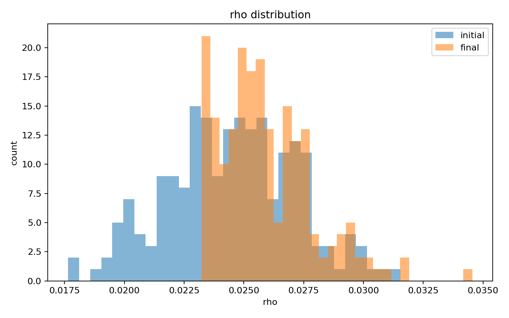

反推 MSE 后可以更直观看到目标误差下降：

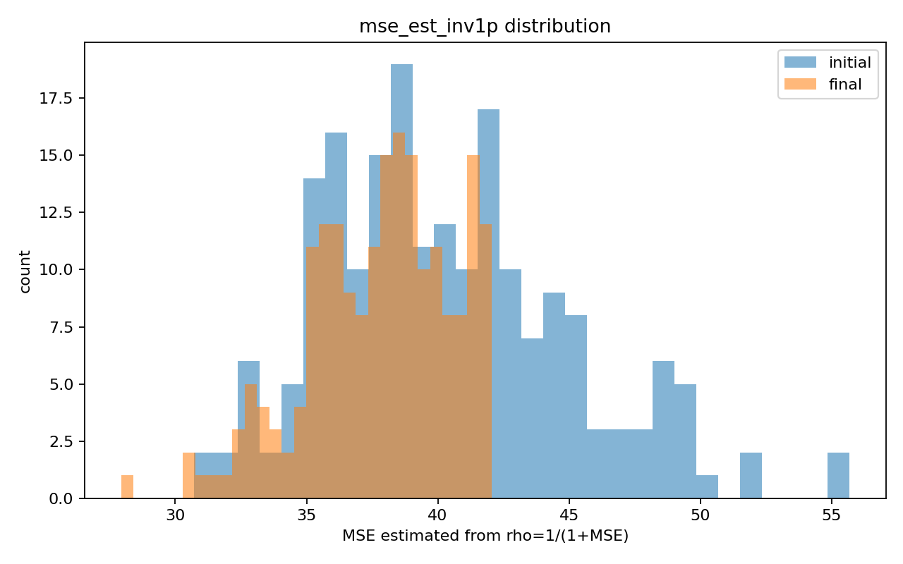

这个变化主要来自 top-M 选择机制。即使 reward 和 tau 的全局统计没有明显迁移，只要变异候选里有一部分
真实仿真后的 ``rho`` 更高，最终 population 就会被筛选得更好。

哪些指标真的变了
----------------

下图展示 final 相对 initial 的标准化均值迁移。最明显的是 ``rho`` 上升和估计 MSE 下降；
其次是 ``best_reward_mean`` 有一定上升。相比之下，``reward_mean``、``tau`` 均值和高维 L2 范数
都只是小幅变化。

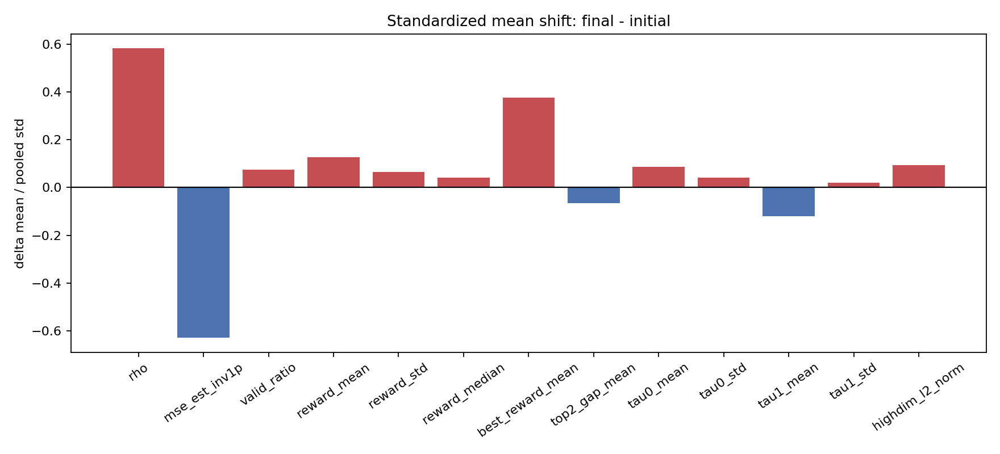

这说明 final population 并没有把整个数据集推到一个完全不同的统计区域。更准确的解释是：
MASDiff 在高度重叠的候选分布中，通过真实仿真评估筛掉了一部分低 ``rho`` 个体。

为什么 reward 均值几乎不变
--------------------------

``reward_mean`` 的分布高度重叠：

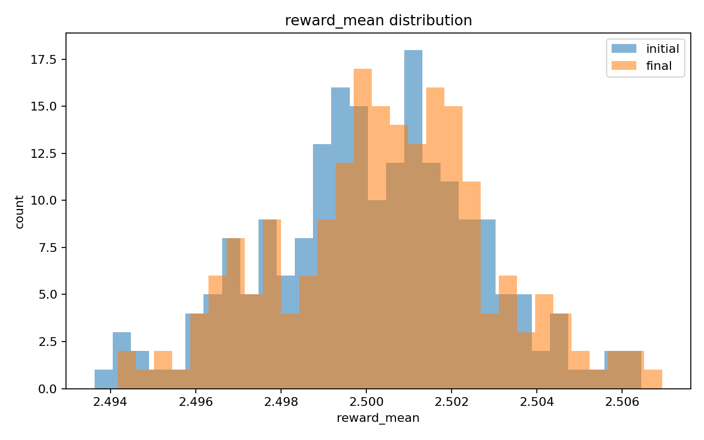

原因有三点。

第一，DQN 训练使用的是 ``rewards[car_idx, action_idx]``，关键不在全局均值，而在候选动作之间的相对排序。
平均 reward 几乎不变，仍可能因为少量关键位置的 action ranking 改变而影响路径选择。

第二，截断扩散是围绕 elite reward 的局部变异，不是从头生成一个远离原分布的新 reward population。
所以它天然更像局部搜索，而不是全局分布迁移。

第三，当前 ``MASDiff/src/diffusion/sumo_ryl_diffusion.py`` 中 ``TauDiffusionModel`` 对 ``tau`` 条件先做
car-road 全局 mean pooling，再广播到道路维度。这会削弱具体 ``car_index``、``road_index`` 位置的条件作用，
导致 reward 变化更像细碎局部扰动。

高维降维说明了什么
------------------

新脚本没有只用 37 维 summary feature，而是把完整 ``tau0``、``tau1``、``reward`` 和有效 mask
组成高维向量，先用确定性 feature hashing 降到 ``128`` 维，再做 PCA。

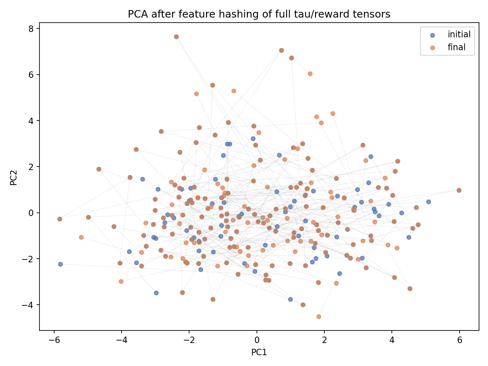

initial 与 final 仍大量重叠，说明即使看完整高维结构，final 也没有形成一个清楚独立的新簇。
这支持“选择 + 局部扰动”的解释。

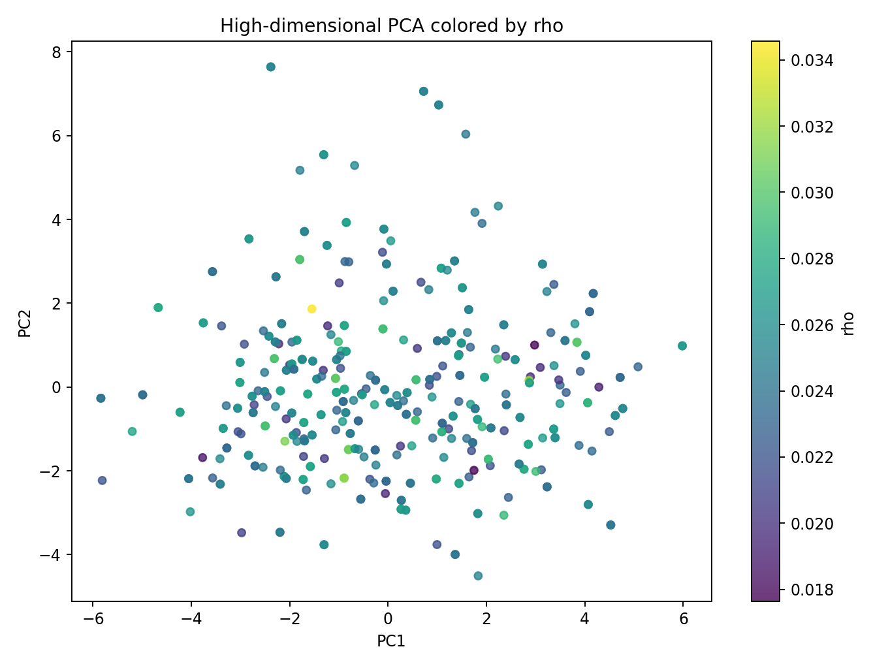

按 ``rho`` 着色后也没有出现明显的单调空间分层，说明 ``rho`` 不是某个简单二维方向的函数。
这也解释了为什么只用全局统计量的 baseline 容易接近常数预测：真正有效的信号可能藏在局部 action ranking
和 SUMO 闭环时序中。

位置热力图结论
--------------

位置热力图的横轴是 ``road_index``，纵轴是 ``car_index``，每个格子表示该 car-road 位置在
200 个 individual 中的平均值。每张图包含 initial、final 和 ``final - initial`` 三个子图。

``tau0_distance`` 完全不变。这符合算法机制：``tau0`` 主要由路网结构和车辆目的地决定，MASDiff 没有改变路网。

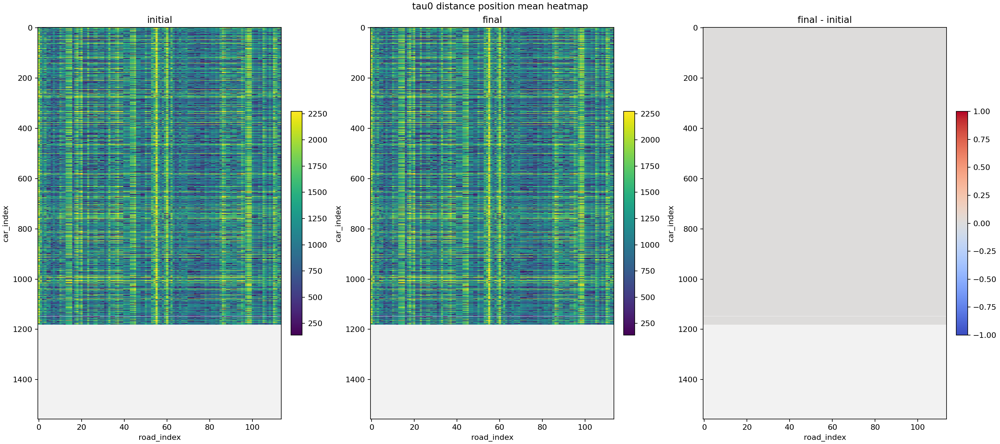

``tau1_queue`` 有局部红蓝变化，但均值只下降 ``0.00747``，中位数差值为 ``0``。它反映的是车辆首次出现时的
局部排队快照，不是整段仿真的完整拥堵轨迹。

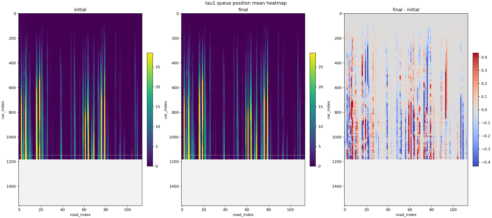

``reward`` 的差值正负几乎各半，位置均值差值约 ``0.00021``。这说明 reward 没有出现稳定的道路列或车辆段整体抬升。

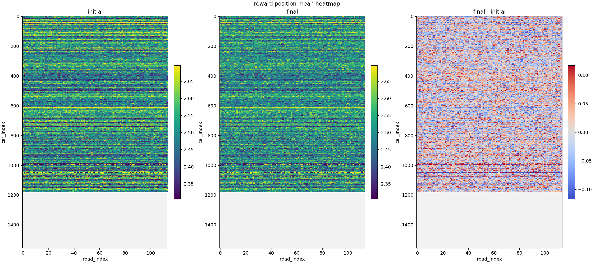

有效位置比例几乎不变，说明数据形状和有效覆盖率不是 ``rho`` 提升的主要来源。

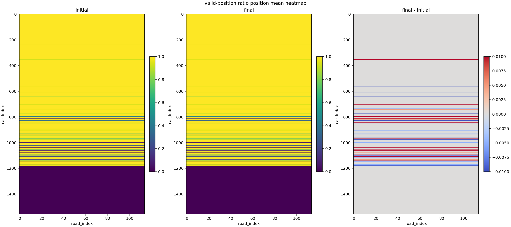

``rho`` 是 individual 级指标，这里只是广播到有效 car-road 位置再求平均。它只能说明 final 的高 ``rho``
覆盖了多数有效区域，不能说明某个 road 或 car 位置单独导致了 ``rho`` 提升。

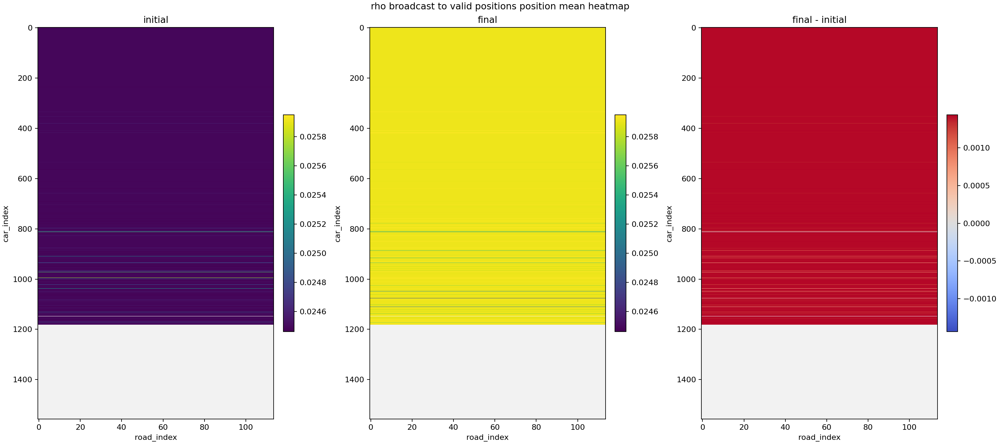

选择压力问题
------------

当前 elite selector 在 ``MASDiff/src/evolution/temperature_selection.py`` 中直接使用：

.. math::

   p_i = \operatorname{softmax}(temperature \cdot \rho_i)

但这批 ``rho`` 的范围只有 ``0.01764`` 到 ``0.03154``。数值太窄会让 softmax 接近均匀采样。

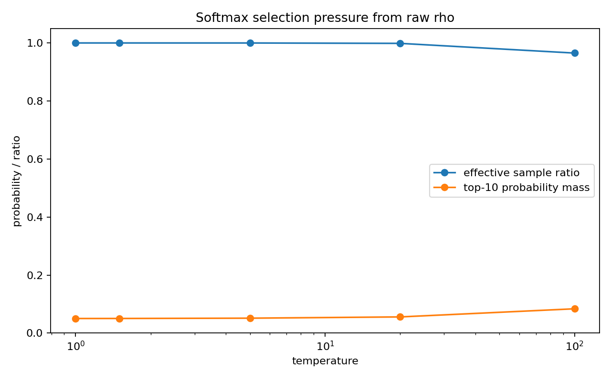

诊断结果显示，``temperature=1.5`` 时有效样本比例约 ``0.99999``，top-10 概率质量只有 ``0.0504``，
几乎等于均匀抽样的 ``0.05``。即使 ``temperature=100``，有效样本比例仍约 ``0.965``。

这解释了为什么 final 有提升但幅度有限：最后的 top-M 保留是有效的，但用于产生 mutants 的 elite 采样并没有强烈偏向好个体。

为什么数据会这样变化
--------------------

综合 MASDiff 代码和这次分析，数据变化的主要原因是：

1. ``rho`` 是完整 SUMO 闭环指标，reward 只是中间训练信号。
   reward 均值不变并不代表 policy 行为不变；少量位置的 action ranking 改变就可能影响路径选择。

2. ``tau0`` 是结构变量，基本不应变化。
   它主要来自路网和目的地，算法没有修改路网，所以 ``tau0_distance`` 不动是合理结果。

3. ``tau1`` 是首次出现时的局部排队快照。
   它会受策略影响，但不是最终评价所用的完整时序，因此它与 ``rho`` 不会一一对应。

4. 扩散模型的条件注入偏全局。
   当前 ``tau`` 条件被 mean pooling，弱化了车-路位置级条件，reward 变化自然更分散。

5. elite 采样压力太弱。
   原始 ``rho`` 范围很窄，softmax 近似均匀；这会削弱“好个体更常被变异”的机制。

6. top-M 保留仍然有效。
   final 的 ``rho`` 分布右移，说明真实仿真评估 + top-M 筛选确实在起作用，只是生成候选的效率不高。

改进方法
--------

优先建议从选择尺度、lineage 记录和生成结构三处改。

1. 改 elite 选择分数。

   不建议直接对原始 ``rho`` 做 softmax。可以改为 rank-based selection、z-score 后的 ``rho``、
   ``-MSE``、``delta_mse`` 或 ``delta_rho``。目标是让 elite 采样真正偏向高质量个体。

2. 明确记录父子关系。

   mutant metadata 中应稳定保存 ``parent_id``、``parent_rho``、``candidate_rho``、
   ``delta_rho``、``iteration_k`` 和是否进入 final population。后续分析应按 lineage 做父子差值，
   不再依赖行号对齐。

3. 强化局部条件生成。

   扩散模型不要只对 ``tau`` 做全局 mean pooling。可以保留 ``[car, road]`` 局部条件，加入 car embedding、
   road embedding、局部 MLP、双轴 attention 或 cross-attention，让每个 reward 位置看到自己的
   ``distance`` 和 ``queue``。

4. 让 surrogate 预测“变好概率”而不是只预测绝对 ``rho``。

   代理模型应重点学习 ``delta_rho``、``delta_mse`` 或候选排序。评估指标应包括 sign accuracy、
   top-k precision、Spearman 相关，而不仅是 MSE。

5. 加入 simulation_data 压缩特征。

   ``rho`` 比较的是 ``Q`` 与 ``simulation_data`` 的排队时序。只看初始 ``tau`` 和 reward summary
   信息不足。建议保存每条路的平均排队、峰值、拥堵持续时间、与 ``Q`` 的分路段误差，或保存
   PCA/autoencoder embedding。

6. 做 action ranking 诊断。

   比 ``reward_mean`` 更重要的是每辆车候选动作的 top-1/top-2 gap、被选动作 reward、
   A* 推荐动作 reward、reward 与距离/排队长度的相关性。这些指标更接近 DQN 最终如何选路。

7. 让真实评估和代理筛选协同。

   当代理与真实 ``rho`` 对齐较弱时，应降低代理权重，更多依赖真实 SUMO 评估和 rank-based top-M；
   当代理诊断稳定后，再用代理预筛掉明显差的候选，以节省仿真成本。

后续实验输出建议
----------------

下一轮 MASDiff 实验建议额外输出三类表：

- ``candidate_lineage.csv``：记录 parent、candidate、delta、是否进入 top-M。
- ``candidate_surrogate.csv``：记录代理分数、真实 ``rho``、``delta_rho``、top-k 命中情况。
- ``simulation_feature.csv``：记录 ``simulation_data`` 相对 ``Q`` 的分路段和时序误差特征。

这样可以把当前的“final 数据集变好了”推进到“哪一种变异真正导致 rho 变好”。
