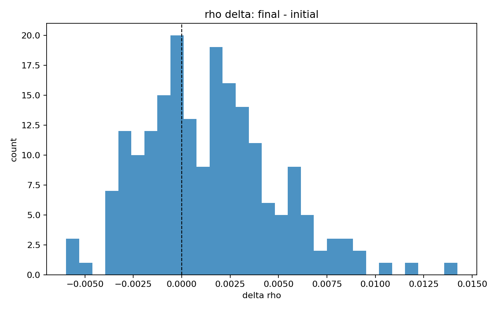
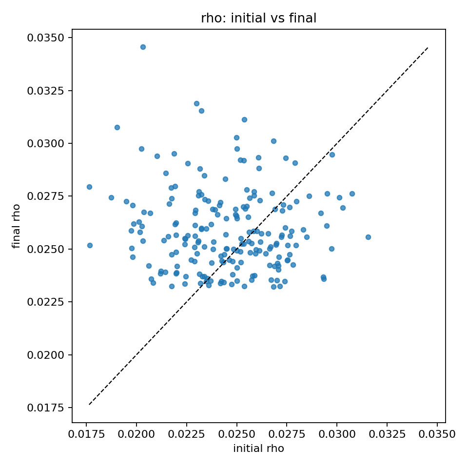
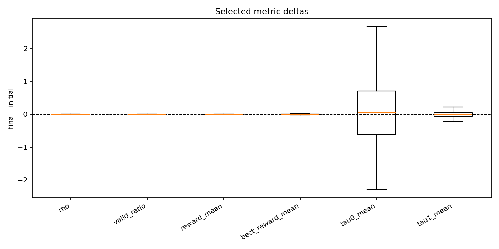
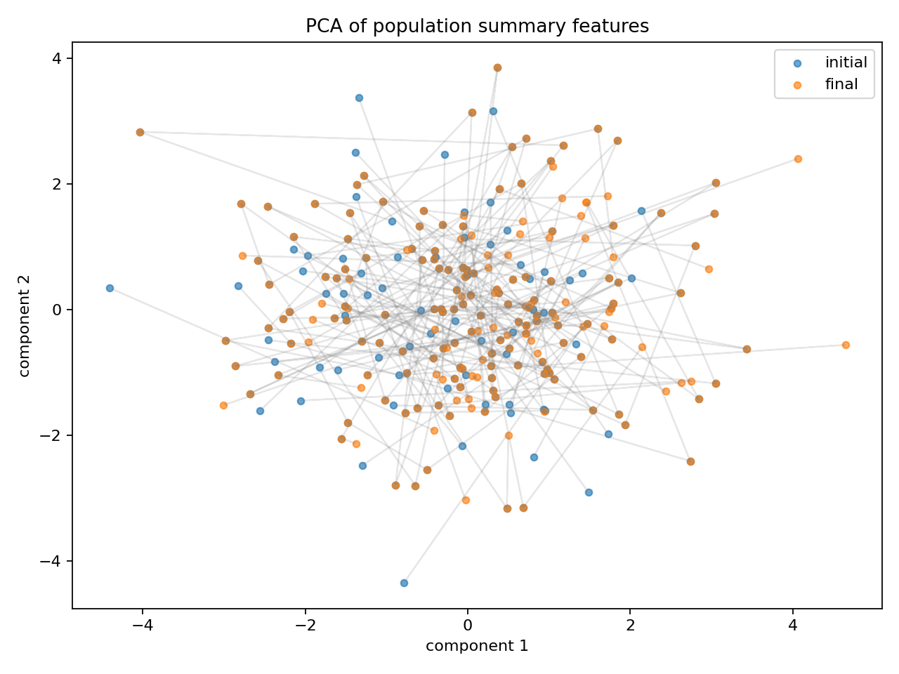

数据集变化分析
==============

本节对 ``initial_population.pkl`` 与 ``final_population.pkl`` 进行配对分析。每个
individual 按 ``index`` 一一对应，比较优化前后的 ``rho``、有效数据比例、reward
统计量以及 ``tau`` 通道统计量变化。

核心结论
--------

- 共比较 200 对 individual。
- ``rho`` 均值从 ``0.024489`` 上升到 ``0.025914``，平均增量为 ``0.001424``。
- ``rho`` 的配对 t 检验 p 值为 ``1.70e-08``，说明整体上升是显著的。
- 123 个 individual 的 ``rho`` 上升，76 个下降，1 个基本不变。
- ``reward_mean``、``valid_ratio`` 和 ``tau`` 均值没有表现出同等明显的整体迁移。
- PCA 图显示 initial 与 final 的 summary feature 分布大量重叠，说明 final population
  更像是在原分布附近发生局部扰动，而不是整体迁移到新区域。

分析方法
--------

分析时先将每个 population 转换为 individual 级 CSV：每个 individual 一行，记录
``rho``、有效比例、reward 分布、best reward、top-2 reward gap，以及 ``tau`` 两个通道的均值、
标准差和分位数。随后按 ``index`` 做 final - initial 的配对差值分析，并输出：

- 均值、标准差、中位数、最小值、最大值。
- 正/负/零变化计数。
- Pearson initial-final 相关系数。
- Cohen's dz 配对效应量。
- 配对 t 检验。
- 分布图、散点图、差值直方图、箱线图和 PCA 低维可视化。

rho 分布变化
------------

``final_population`` 的 ``rho`` 分布整体向右移动，低 ``rho`` 样本减少，中高 ``rho`` 样本增加。
这是最直接体现 final population 改善的图。

.. image:: images/rho_distribution.png
   :alt: rho distribution
   :align: center

rho 配对差值
------------

大部分样本的 ``rho`` 变化集中在 0 附近，但正值区域更厚，右尾更长，说明多数个体有提升，
且少数样本提升幅度较大。

rho 初始值与最终值
------------------

虚线表示 ``final = initial``。图中较多点位于虚线上方，说明 final 的 ``rho`` 通常更高。
但点云较分散，说明 initial 的个体排序没有稳定延续到 final。

reward 均值分布
---------------

``reward_mean`` 的 initial 与 final 分布高度重叠，说明平均 reward 并没有发生明显整体迁移。
因此 ``rho`` 的提升不是简单由全局平均 reward 上升解释的。

.. image:: images/reward_mean_distribution.png
   :alt: reward mean distribution
   :align: center

关键指标差值箱线图
------------------

不同指标量纲不同，因此该图主要用于观察每个指标自身是否偏离 0。``tau0_mean`` 的个体波动最大，
但中位数接近 0；``rho``、``reward_mean``、``valid_ratio`` 等指标的绝对变化量较小。

PCA 整体结构变化
----------------

PCA 将多个 summary feature 压缩到二维。蓝点为 initial，橙点为 final，灰线连接同一个
individual 的初始和最终状态。两类点大量重叠，说明 final population 没有形成清晰独立的新群体；
灰线方向较分散，说明个体变化方向不统一。

