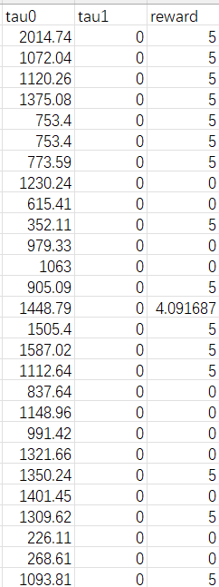
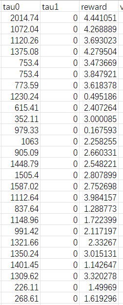

历史
====

.. mermaid::

   graph TD
      base["基础"]
      fix["修复数据集"]
      simple["简化模型"]
      aggregate["聚合方法修改"]
      mlp["将模型简化为 MLP"]
      methods["添加两种聚合方法 meanmax 和 attention"]

      base --> fix
      fix --> simple
      fix --> aggregate
      simple --> mlp
      aggregate --> methods

修复数据集
----------

